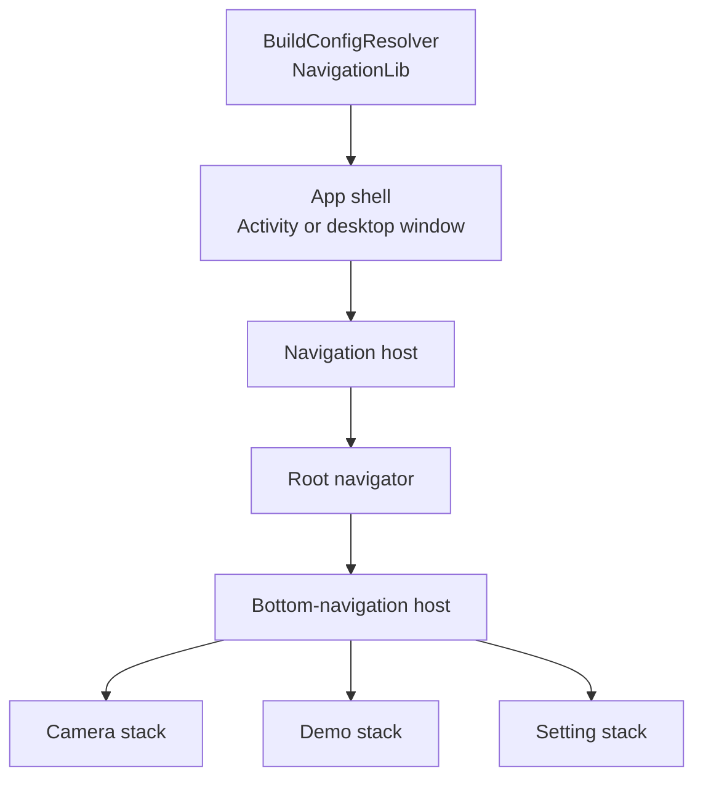

# Navigation Toolkit

This module integrates every navigation engine used by the project.

It owns routes, graphs, engine adapters, stack operations, and navigation host selection. Feature
modules own navigation intent and UI. The app entry point owns only the platform window, Android
containers, theme, and splash gating.

## Architecture



There are two navigation levels:

1. The root host owns app-level destinations.
2. The bottom-navigation host owns one stack for every tab.

Opening Setting from Camera is a root-host operation. Opening Movie from Demo is an operation on
the active Demo tab stack.

## Ownership

`:infrastructure:navigation` owns:

- `NavigationLib` dispatch.
- Nav3, Voyager, Vanilla, Destinations, and Jetpack adapters.
- Route declarations and route-to-screen wiring.
- Root and nested navigation hosts.
- Multiple-back-stack implementation details.
- Voyager screen registration.
- Destinations generated-route integration.
- Jetpack XML graphs and trampoline fragments.
- Translation from feature navigation events to engine routes.

Feature modules own:

- Navigation events such as `DemoNavigationEvent`.
- Navigator contracts such as `DemoNavigator`.
- Screens and presentation behavior.
- Calls that express navigation intent.

`:ui:feature-bottomnavigation` owns:

- Tab items and the default tab.
- Shared tab and back-handling state.
- `BottomNavigationUiState` and `BottomNavigationUiAction`.
- The bottom bar and platform back-handler UI.
- The library-neutral `BottomNavigator` contract.

`:infrastructure:di` owns:

- Navigation-related Koin bindings.
- The current bottom-navigation state owner.
- Common and Android-specific bottom-navigation ViewModel bindings.

The app shell owns:

- Activity or window creation.
- Compose and Fragment containers.
- Splash and theme installation.
- Passing the configured `NavigationLib`.

Feature modules must not import Nav3 keys, Voyager screens, generated Destinations directions,
Android `NavController`, Fragment navigation IDs, or XML graph IDs.

## Engine Support

| Engine | Source set | Platform | Role |
| --- | --- | --- | --- |
| Nav3 | `commonMain` | Android and desktop | Primary CMP engine |
| Voyager | `commonMain` | Android and desktop | CMP fallback |
| Vanilla | `androidMain` | Android | Legacy Compose Navigation |
| Destinations | `androidMain` | Android | Generated Android navigation |
| Jetpack | `androidMain` | Android | Deprecated Fragment navigation |

Nav3, Voyager, Vanilla, and Destinations cover the full Compose feature roster. Jetpack keeps its
existing reduced roster. Hint Phone Number, Movie, and Dialog are intentionally unsupported by
Jetpack.

Desktop rejects Vanilla and Destinations explicitly. Jetpack uses an Android Fragment surface and
cannot be rendered through the common Compose host.

## Runtime Selection

The selected engine follows this path:

```text
Generated build configuration
`-- BuildConfigResolver
    `-- MainVM.navigationLib
        `-- AndroidNavigationHost or desktop Compose host
            `-- NavigationContent
```

[`NavigationContent.kt`](./src/commonMain/kotlin/com/velord/infrastructure/navigation)
contains the exhaustive `NavigationLib` dispatch.

On Android,
[`AndroidNavigationHost.kt`](./src/androidMain/kotlin/com/velord/infrastructure/navigation)
chooses the rendering surface:

- Jetpack shows the Fragment container and installs `main_nav_graph`.
- Every Compose engine shows the Compose container and calls `NavigationContent`.

Do not add engine-specific branches back to `MainActivity`.

## Feature Navigation Contract

A feature describes intent without naming a navigation library:

```kotlin
enum class ProfileNavigationEvent {
    Detail,
    Setting,
}

interface ProfileNavigator {
    fun goTo(event: ProfileNavigationEvent)
}
```

The screen emits `ProfileNavigationEvent`. The infrastructure adapter implements
`ProfileNavigator` and translates every event to the selected engine route.

Use one feature-owned contract for every engine. Do not create
`ProfileNavigatorNav3` in the feature module.

When adding an event:

1. Add the event to the feature contract.
2. Add a Nav3 route and mapping.
3. Add a Voyager provider and mapping when the feature belongs to the CMP roster.
4. Add Destinations and Vanilla routes.
5. Add Jetpack XML or mark the route intentionally unsupported.
6. Extend exhaustive and uniqueness tests.

Nav3 is the first implementation for new navigation work. Destinations and Vanilla must keep their
full current roster. Voyager remains the CMP fallback and must not silently lose a shared route.

## Bottom-Navigation Contract

`BottomNavigator.kt` in
[`navigation`](../../ui/feature-bottomnavigation/src/commonMain/kotlin)
is the neutral boundary between the bottom-navigation UI and an engine:

```kotlin
interface BottomNavigator {
    fun onTabClick(tab: TabState)

    @Composable
    fun CreateNavHostForBottom(
        modifier: Modifier,
        startRoute: BottomNavigationItem,
    )

    @Composable
    fun SetupNavController(
        updateBackHandling: (List<String?>, String?) -> Unit,
        onTabChanged: (BottomNavigationItem) -> Unit,
    )
}
```

The engine adapter must:

- Create or expose the active tab host.
- Switch tabs after a `TabState` event.
- Pop the selected tab to its root on reselection.
- Preserve inactive tab stacks.
- Report the current route and all tab-root routes.
- Report engine-driven tab changes to the ViewModel.

Library objects stay inside the adapter. Only `BottomNavigationItem`, `TabState`, and neutral route
identities cross this boundary.

## Tab State

`BottomNavEventService.kt` in
[`feature-bottomnavigation`](../../ui/feature-bottomnavigation/src/commonMain/kotlin)
is the state bridge for the current bottom-navigation host. It stores:

- `currentTabStateFlow`.
- `backHandlingStateFlow`.

`TabState.DEFAULT` is the product default. It currently selects Demo.

Keep these values aligned:

- `TabState.DEFAULT`.
- The bottom-navigation UI initial state.
- The Nav3 `NavigationState` start route.
- The Voyager initial tab.
- The Vanilla graph start.
- The Destinations graph start.
- The Jetpack multiple-back-stack selection.

A mismatch creates startup races, incorrect highlighting, or an immediate back transition.

`TabDestinationChanged` updates the selected UI tab without emitting another navigation event.
This prevents a navigator-to-ViewModel-to-navigator loop.

## Back Handling

Back handling has two inputs:

- Whether the active destination is a tab root.
- Whether the current graph has granted the parent permission to handle back.

The result is one of:

| Behavior | Result |
| --- | --- |
| `DelegateToNavigator` | The active engine or system handles back |
| `ReturnToDefaultTab` | Parent selects `TabState.DEFAULT.current` |
| `ConfirmExit` | First back warns; second back requests app exit |

The current root behavior is:

| Location | Grant | Behavior |
| --- | --- | --- |
| Any child destination | Any | Delegate to navigator |
| Camera root | Any | Return to Demo |
| Demo root | Any | Delegate to navigator or system |
| Setting root | No | Delegate to navigator or system |
| Setting root | Yes | Confirm exit |

This policy lives in `BottomNavigationUiState.kt` under
[`feature-bottomnavigation`](../../ui/feature-bottomnavigation/src/commonMain/kotlin).
Platform handlers must execute the selected behavior, not reimplement tab policy.

### Graph Ownership

Screens can change parent ownership through `BottomNavigationUiAction`:

- `GraphTakeResponsibility` disables parent interception.
- `GraphCompletedHandling` allows parent interception at a root destination.

Navigating to a child destination automatically revokes the grant. Returning to the root does not
restore it automatically. The graph must complete its own work and grant the parent again.

Omitting `GraphCompletedHandling` is valid. It leaves root back handling to the engine or system.

Do not dispatch ownership actions during uncontrolled startup work. The engine must report its
current destination first. This avoids a race between the default tab and the first rendered
destination.

### Platform Behavior

Android uses:

- No Compose `BackHandler` for `DelegateToNavigator`.
- `BackHandler` for `ReturnToDefaultTab`.
- `SnackBarOnBackPressHandler` for `ConfirmExit`.

Desktop has no system back button in this module. Window closing remains owned by the desktop app
shell.

App exit is not a direct Activity operation. `BackDoubleClick` calls `RequestAppExitUC`, which
emits the app-level exit event.

## Multiple Back Stacks

Every tab owns a separate stack. Required behavior:

1. Switching tabs preserves the stack being left.
2. Returning to a tab restores its stack.
3. Reselecting the active tab pops only that stack to its root.
4. Back from a child pops that child.
5. Root behavior is selected by `BottomNavigationUiState`.
6. Root-host destinations do not enter a tab stack.

Do not replace this with one flat stack. The engine APIs differ, but the product behavior is the
same.

## Nav3

Nav3 is the primary CMP implementation.

Key files:

- `GraphNav3.kt`.
- `NavigationState.kt`.
- `BackStackNavigator.kt`.
- `SupremeNavigatorNav3.kt`.

Source:
[`compose/nav3`](./src/commonMain/kotlin/com/velord/infrastructure/navigation/compose/nav3)

Construction:

1. Declare a serializable `GraphNav3` key.
2. Register the key in the correct `EntryProviderScope`.
3. Render the feature screen and inject its ViewModel.
4. Implement or delegate the feature navigator contract.
5. Add top-level keys to the top-level route set only when they own tab stacks.
6. Add event mapping and uniqueness tests.

`NavigationState` stores one `NavBackStack` for every top-level tab. Changing `topLevelRoute`
switches the visible stack without deleting the other stacks.

`BackStackNavigator` performs:

- Top-level route switch.
- Child-route push.
- Child pop.
- Return from a non-default tab root to the default tab.
- Active-tab pop-to-root.

The outer `SnapshotStateList` belongs to app-level navigation. Camera-to-Setting adds Setting to
that outer stack.

Every Nav3 key must serialize without reflection-dependent behavior. Extend restoration tests when
adding a key with parameters.

## Voyager

Voyager is the CMP fallback.

Key files:

- `ScreenRegistry.kt`.
- `VoyagerModule.kt`.
- `BottomNavigationVoyagerScreenImpl.kt`.
- `VoyagerBottomNavigationTab.kt`.

Sources:

- [`voyager`](./src/commonMain/kotlin/com/velord/infrastructure/navigation/voyager)
- [`bottom-navigation Voyager`](../../ui/feature-bottomnavigation/src/commonMain/kotlin)

Construction:

1. Add a provider contract to `SharedScreenVoyager`.
2. Create the concrete Voyager `Screen` adapter in this module.
3. Register the provider exactly once in `VoyagerModule`.
4. Map the feature event to its provider.
5. Resolve feature ViewModels through Koin inside the screen adapter.
6. Add registry, mapping, and unique-key tests.

`initVoyager()` is platform-neutral and idempotent. It must run before any provider is resolved.

Each tab creates a nested `Navigator`. The outer `LocalNavigator` hosts the bottom-navigation
screen and cannot describe the active child stack.

`LocalVoyagerNavigatorObserver` reports the active nested navigator and neutral route keys to the
bottom-navigation parent. Keep Voyager objects in the adapter. The ViewModel receives route
identities only.

Camera-to-Setting must navigate through the root Voyager navigator, not the active tab navigator.

## Vanilla Compose Navigation

Vanilla is the Android-only, typed Compose Navigation implementation.

Key files:

- `GraphVanilla.kt`.
- `SupremeNavigatorVanilla.kt`.
- `BottomTabNavigatorVanilla.kt`.

Source:
[`compose/vanilla`](./src/androidMain/kotlin/com/velord/infrastructure/navigation/compose/vanilla)

Construction:

1. Add a serializable typed route to `GraphVanilla`.
2. Register it in the owning `NavGraphBuilder`.
3. Map the feature event to the route.
4. Distinguish tab graph routes from tab start routes.
5. Keep app-level routes on the supreme controller.

The bottom host owns a `NavHostController`. Tab switching uses `saveState`, `restoreState`, and
`launchSingleTop`. Reselection pops to the selected tab start.

The adapter observes `currentBackStackEntryAsState`, derives tab-root routes, and reports the
active tab to the shared ViewModel.

## Compose Destinations

Destinations is Android-only in this project.

Key files:

- `MainGraphDestinations.kt`.
- `SupremeNavigatorDestinations.kt`.
- `BottomTabNavigatorDestinations.kt`.

Source:
[`compose/destinations`](./src/androidMain/kotlin/com/velord/infrastructure/navigation/compose)

Construction:

1. Add or reuse the correct graph annotation.
2. Annotate the destination in `androidMain`.
3. Build Android KSP generated sources.
4. Use the generated destination or graph class.
5. Map the feature event to that generated type.
6. Keep dependencies in the generated host container.

Generated classes are part of the integration contract. Do not replace them with hand-written
route strings and do not edit generated files.

The processor is wired through `kspAndroid`. The KSP module name remains `navigation`.

Dynamic `DestinationsNavHost.start` is intentionally disabled because it breaks saved multiple
back stacks. Preserve the commented line and issue reference:

<https://github.com/raamcosta/compose-destinations/issues/667>

## Jetpack Fragment Navigation

Jetpack Navigation is deprecated but must keep compiling and preserve existing behavior.

Key files:

- [`main_nav_graph.xml`](./src/androidMain/res/navigation/main_nav_graph.xml)
- [`bottom_nav_graph.xml`](./src/androidMain/res/navigation/bottom_nav_graph.xml)
- `BottomNavigationFragment.kt`.
- `AndroidBottomNavigationGraphItem.kt`.

Source:
[`feature-bottomnavigation`](../../ui/feature-bottomnavigation/src/androidMain/kotlin)

Construction:

1. Add the Fragment destination and action to the owning XML graph.
2. Add the feature Fragment or an infrastructure-owned trampoline.
3. Add the tab graph ID and start destination ID when creating a tab.
4. Update `BottomNavigationJetpackVM` route handling.
5. Preserve the existing deprecation fallback for unsupported features.

Jetpack uses `MultipleBackstack` and Android resource IDs. Its ViewModel remains Android-specific
because `NavDestination` is part of its input.

Trampoline fragments must verify that the controller is still at the trampoline before navigating.
Android state restoration can restore the target Fragment before `onViewCreated` runs again.
Navigating unconditionally causes a missing-action crash.

The Android KMP plugin packages navigation XML through
`prepareAndroidMainNavigationResources`. Keep the task when changing resource layout.

## Adding A Destination

Use this checklist:

1. Define or extend the feature-owned navigation event.
2. Confirm whether the destination belongs to the root host or a tab stack.
3. Implement the Nav3 key, entry, and event mapping.
4. Implement the Voyager provider, screen adapter, registration, and event mapping.
5. Implement the Vanilla typed route and graph entry.
6. Implement the Destinations annotation and generated mapping.
7. Implement Jetpack XML or mark the route intentionally unsupported.
8. Inject the feature ViewModel at the adapter boundary.
9. Decide whether the destination changes graph back ownership.
10. Add mapping, uniqueness, serialization, and stack tests.
11. Run Android and desktop compilation.
12. Exercise the manual behavior matrix.

Root-host destinations must use the supreme navigator. Tab children must use the active tab
navigator.

## Adding A Tab

Use this checklist:

1. Add one `BottomNavigationItem`.
2. Add its label, icon, and UI selection.
3. Decide whether it is the default tab.
4. Add an explicit root back behavior.
5. Add its Nav3 top-level route and independent `NavBackStack`.
6. Add its Voyager tab and nested `Navigator`.
7. Add its Vanilla graph route and start route.
8. Add its Destinations graph and generated direction.
9. Add its Jetpack graph IDs and `MultipleBackstackGraphItem`.
10. Update route-to-tab synchronization in every engine.
11. Add exhaustive tab, back-policy, and independent-stack tests.
12. Test switch, restore, reselection, child back, and root back.

Every tab must have an explicit root behavior. A new enum entry must not fall through to a generic
default that hides a missing product decision.

## Creating Another Bottom-Navigation Module

The app may contain multiple independent bottom-navigation hosts. The current
`:ui:feature-bottomnavigation` module is one host, not a global singleton design.

Use a feature module:

```text
:ui:feature-<scope>-bottomnavigation
```

Its package root is:

```text
com.velord.ui.feature.<scope>.bottomnavigation
```

For example:

```text
:ui:feature-account-bottomnavigation
com.velord.ui.feature.account.bottomnavigation
```

Give every host scoped types:

- `AccountBottomNavigationItem`.
- `AccountTabState`.
- `AccountBottomNavigationUiState`.
- `AccountBottomNavigationUiAction`.
- `AccountBottomNavigationVM`.
- `AccountBottomNavigator`.
- `AccountBottomNavEventService`.

Do not reuse the current unqualified `BottomNavEventService`. It is a Koin singleton. Sharing it
would couple selected tabs, graph ownership, and exit behavior between independent hosts.

Bind each host state owner and ViewModel independently:

```kotlin
val accountBottomNavigationModule = module {
    singleOf(::AccountBottomNavEventService)
    viewModel {
        AccountBottomNavigationVM(
            bottomNavEventService = get(),
            requestAppExitUC = get(),
        )
    }
}
```

Use a distinct state-owner type instead of a string qualifier. It keeps constructor injection
typed and prevents accidental cross-host resolution.

For each engine:

1. Add a root route that opens the new bottom-navigation host.
2. Create a host-specific engine adapter.
3. Create one independent stack per host tab.
4. Keep the host default aligned with each engine start route.
5. Translate only that host's tab model.
6. Keep feature event adapters separate from host tab adapters.
7. Test that navigation in one host cannot mutate the other host.

Do not generalize both modules into a framework before the second host works. Extract shared code
only where two real hosts prove the same stable contract.

Required isolation tests:

- Each host resolves a different state-owner instance.
- A tab click changes only its owning host.
- A graph grant changes only its owning host.
- Restoring one host does not replace another host's stacks.
- App-level navigation can leave one host and return with its state intact.

## Generated Code And Resources

Do not edit or commit generated Destinations code.

Android generated source and resource directories may appear in the IDE. They are build output,
not module source.

Navigation XML is source and belongs under:

```text
src/androidMain/res/navigation
```

Kotlin source belongs under:

```text
src/commonMain/kotlin
src/androidMain/kotlin
src/desktopMain/kotlin
```

Never add Kotlin source under a `java` directory.

## Diagnostics

These declarations are navigation diagnostics, not product features:

- `TestScreen`.
- `TestVoyagerScreen`.
- `InDevelopmentFragment`.
- `InDevelopmentVM`.
- `InDevelopmentUiAction`.

They verify adapter or back-stack behavior. Keep their purpose comments. Do not route normal
feature behavior through them.

Back-stack logs use the `LogBackStack` family of tags. Useful observations include:

- Active top-level tab.
- Current destination.
- Active stack size.
- Tab reselection.
- Root versus child classification.
- Selected `BottomNavigationBackBehavior`.

## Tests

Common navigation tests cover:

- One Nav3 stack per top-level route.
- Active-stack isolation.
- Tab reselection.
- Child back and root back.
- Outer Camera-to-Setting navigation.
- Nav3 serialization and restoration.
- Unique event-to-route mappings.
- Voyager registry idempotence.
- Voyager provider coverage and unique keys.

Bottom-navigation tests cover:

- Explicit behavior for every tab.
- Child destinations always delegating to the navigator.
- Default-tab selection.
- Tab switch and reselection events.
- Return to the default tab.
- Double-back app exit.
- Route-root detection.
- Graph ownership grant and revocation.
- State synchronization through the host state owner.

Run focused verification with the required D-drive cache:

```powershell
$env:GRADLE_USER_HOME = "D:\Android Project\gradleCache"
.\gradlew.bat --console=plain `
    :infrastructure:navigation:allTests `
    :infrastructure:navigation:compileAndroidMain `
    :infrastructure:navigation:compileKotlinDesktop `
    :ui:feature-bottomnavigation:allTests `
    :ui:feature-bottomnavigation:compileAndroidMain `
    :ui:feature-bottomnavigation:compileKotlinDesktop `
    :infrastructure:di:compileAndroidMain `
    :infrastructure:di:compileKotlinDesktop `
    :infrastructure:konsist:test
```

BuildConfig permits only one flavor per Gradle invocation. Compile app variants separately.

## Manual Behavior Matrix

For every selectable engine:

1. Launch its expected default tab.
2. Open a child destination.
3. Switch tabs.
4. Open a child in the second tab.
5. Return and verify the first stack is restored.
6. Reselect the active tab and verify only that tab returns to root.
7. Press back from a child and verify the child stack handles it.
8. Press back from Camera root and verify the default tab opens.
9. Press back from Demo root and verify engine or system handling.
10. Grant Settings root handling and verify the exit warning.
11. Press back again within the interval and verify app exit.
12. Open Setting from Camera and verify back returns to Camera.
13. Recreate the Activity or composition and verify supported restoration.

Run this matrix after changing:

- A start destination.
- A tab.
- Route observation.
- Graph ownership.
- Stack save or restore logic.
- Koin scope or state-owner binding.
- Engine selection.

## Troubleshooting

### Wrong tab is selected at startup

Check `TabState.DEFAULT`, the engine start route, and the first route observation. Do not force the
default tab after the engine has already reported its restored destination.

### Back exits immediately

Check:

- Whether the destination was classified as a root.
- Whether the graph called `GraphCompletedHandling`.
- The current tab's `backBehavior`.
- Whether the platform handler received `DelegateToNavigator`.

### Back warning never appears

`ConfirmExit` currently requires Setting root plus a graph grant. A child destination revokes the
grant.

### Tab stacks overwrite each other

Verify that every top-level tab owns a separate stack or saved state. Do not use one mutable stack
for every tab.

### Voyager reports the outer navigator

Observe the nested tab `Navigator` through `LocalVoyagerNavigatorObserver`. The parent
`LocalNavigator` is the root host and cannot classify the active tab stack.

### Destinations loses saved stacks

Do not enable dynamic `DestinationsNavHost.start`. See issue
<https://github.com/raamcosta/compose-destinations/issues/667>.

### Jetpack crashes from a trampoline Fragment

Before navigating, verify that `currentDestination` is still the trampoline destination. Restored
state may already contain the target Fragment.

### Generated Destinations classes do not resolve

Check:

- The destination remains in `androidMain`.
- `kspAndroid` still contains the Destinations processor.
- The KSP module name is `navigation`.
- The generated class name is used instead of a hand-written guess.

### Android navigation XML is missing

Check `prepareAndroidMainNavigationResources` and confirm XML remains in
`src/androidMain/res/navigation`.

### Desktop starts an unsupported engine

Fix build selection. Do not silently substitute Nav3 or Voyager for Vanilla, Destinations, or
Jetpack.

## Definition Of Done

Navigation work is complete only when:

- Feature code exposes intent without engine types.
- Every supported engine maps the new intent exactly once.
- Nav3 and Voyager compile from `commonMain`.
- Android-only engines compile from `androidMain`.
- Tab stacks remain independent.
- Start routes and default tab are aligned.
- Root and child back behavior is explicit.
- App-level destinations use the root host.
- Generated code and XML resources build.
- Focused tests and Konsist pass.
- The manual matrix passes for every affected engine.
- All touched files are staged and `git diff --cached --check` passes.

## External References

- Navigation 3 for Compose Multiplatform:
  <https://kotlinlang.org/docs/multiplatform/compose-navigation-3.html>
- [Voyager](https://github.com/adrielcafe/voyager)
- [Compose Navigation](https://developer.android.com/develop/ui/compose/navigation)
- [Compose Destinations](https://github.com/raamcosta/compose-destinations)
- [Jetpack Navigation](https://developer.android.com/guide/navigation)
